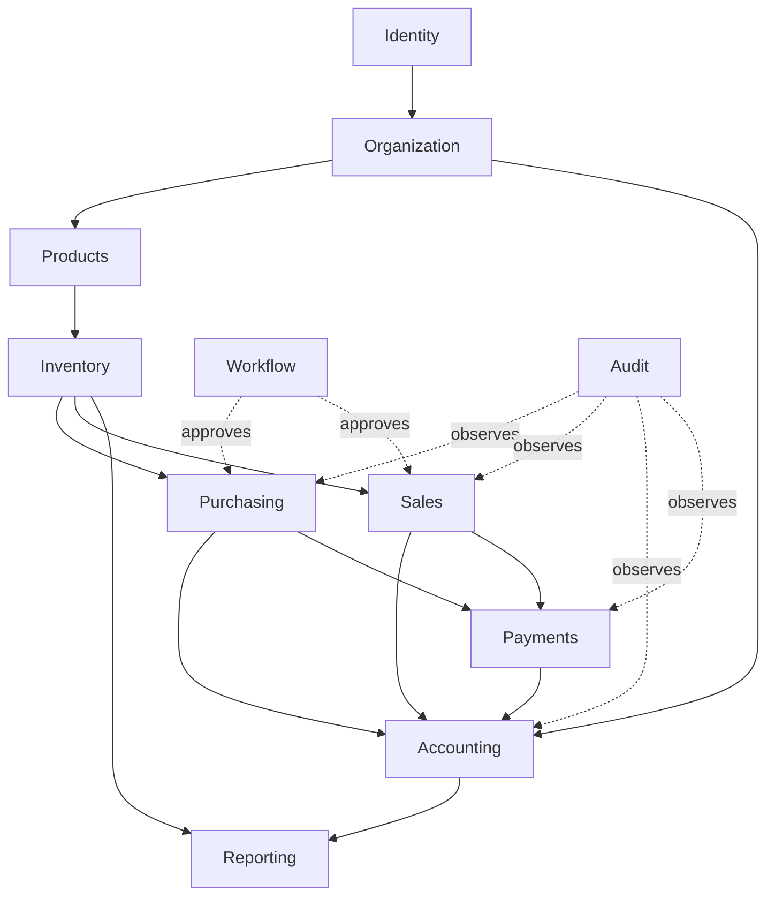

# Architecture

## Guiding principle

Filament is the **interface layer only**. All business rules — permissions,
stock availability, accounting validity, prices, discounts, tax, balances,
valuation — live in the application/domain layer and are enforced server-side.
A malicious user cannot bypass a rule by editing a browser request (spec #5).

## Layering

```
┌──────────────────────────────────────────────────────────────┐
│  Filament Resources / Pages / Widgets   (UI only, thin)        │
├──────────────────────────────────────────────────────────────┤
│  Actions        one use-case = one DB transaction = all-or-    │
│                 nothing side effects (records+inventory+journal │
│                 +audit). e.g. PostSalesInvoice, ReceiveGoods    │
├──────────────────────────────────────────────────────────────┤
│  Domain         pure business logic, framework-light           │
│    Accounting · Inventory · Purchasing · Sales · Payments ·     │
│    Workflow · Documents · Pricing                              │
├──────────────────────────────────────────────────────────────┤
│  Services / Support   Money VO, DocumentNumberGenerator,        │
│                       ValuationStrategy, CompanyContext          │
├──────────────────────────────────────────────────────────────┤
│  Models (Eloquent)    data access, relationships, global scopes │
│  Policies             authorization (Spatie + Gates)            │
├──────────────────────────────────────────────────────────────┤
│  PostgreSQL           constraints, triggers, sequences          │
└──────────────────────────────────────────────────────────────┘
```

### Directory layout (target, created in Phase 2)

```
app/
  Domain/
    Accounting/{Journal,Posting,TrialBalance,Period,ChartOfAccounts}
    Inventory/{Ledger,Valuation,StockPolicy,Uom}
    Purchasing/  Sales/  Payments/  Workflow/  Documents/  Pricing/
  Actions/                 # orchestration; each wraps DB::transaction
  Services/                # Money, DocumentNumberGenerator, CompanyContext
  Support/                 # value objects, enums, exceptions
  Models/                  # Eloquent + global CompanyScope
  Policies/
  Filament/{Resources,Pages,Widgets,Clusters}
database/{migrations,seeders,factories}
tests/{Unit,Feature,Concurrency,EndToEnd}
docs/
```

**Iron rule (spec #26 — atomicity):** any operation with accounting or
inventory impact is performed inside a single `DB::transaction`. Either every
side effect commits or the whole thing rolls back. Never "stock deducted but
invoice missing," never "invoice exists but journal missing."

## Domains & responsibilities

| Domain | Owns |
|---|---|
| Identity | users, authentication, sessions |
| Organization | companies, branches, departments, warehouses |
| Products | products, categories, brands, UOM & conversions |
| Inventory | inventory ledger, stock balances, valuation, transfers, adjustments |
| Purchasing | PR → PO → GRN → supplier invoice state machine |
| Sales | Quotation → SO → Delivery → invoice state machine, pricing |
| Accounting | chart of accounts, journals, ledger, periods, reports |
| Payments | receipts/payments, allocation, AR/AP derivation |
| Workflow | configurable approval engine |
| Documents | attachments, storage abstraction |
| Notifications | in-app notifications; optional mail/SMS adapters |
| Reporting | read-model reports derived from authoritative ledgers |
| Audit | immutable audit log |
| Settings | company-configurable parameters |

## Module dependency map


Build order follows the arrows: nothing is built before its dependencies.

## Single source of truth (spec #32, #65)

There is exactly one authoritative record for each kind of truth. Everything
else is **derived** (a read model / report), never independently stored:

| Truth | Authoritative source |
|---|---|
| Money / financial position | `journal` + `journal_line` (double-entry) |
| Stock quantity & valuation | `inventory_transaction` ledger |
| Workflow state | document `status` + transition log |
| Permissions | server-side authorization (Spatie + Policies) |
| Customer / supplier balance | derived from journals (AR/AP accounts + subledger) |

Dashboards and reports **must** read from these sources. No parallel "dashboard
profit" vs "ledger profit" (spec #33).

## Multi-company model (spec #6)

Single database, shared schema, **`company_id` on every company-scoped table**.
Isolation is enforced server-side by a global Eloquent scope that injects the
authenticated user's authorized company; the client's `company_id` is never
trusted. Filament tenancy binds the active company to the user's membership.
Multi-database was rejected because it fragments consolidated accounting and
cross-company reporting.

## Money & precision (spec #52)

No PHP `float` ever touches money. Monetary values are a `Money` value object
(`brick/money` + bcmath) persisted to `NUMERIC` columns. Precision is
configurable (`CURRENCY_PRECISION`, `QUANTITY_PRECISION`, `COST_PRECISION`) and
a single rounding strategy is applied everywhere: invoices, payments,
accounting, inventory, reports.

## Configuration over hard-coding (spec #51, #54)

No `if company == 'ABC'`, no hard-coded thresholds. Currency, tax rates, fiscal
year, numbering formats, stock/negative-inventory policy, approval thresholds,
default warehouse, default accounts, rounding, and precision are all stored as
per-company settings.

## Error taxonomy (spec #67)

Domain failures raise typed exceptions mapped to stable codes, never raw stack
traces to users: `INSUFFICIENT_STOCK`, `PERMISSION_DENIED`, `PERIOD_CLOSED`,
`INVALID_STATE_TRANSITION`, `DUPLICATE_DOCUMENT_NUMBER`, `UNBALANCED_JOURNAL`,
`DUPLICATE_PAYMENT`, `INVALID_RETURN_QUANTITY`.

## Phased plan

| Phase | Deliverable | Gate |
|---|---|---|
| 1 | Architecture + docs (this) | reviewed |
| 2 | DB schema + migrations + seed skeleton | `migrate:fresh` clean |
| 3 | Auth + RBAC + company isolation | authz tests pass |
| 4 | Organization, products, UOM | feature tests |
| 5 | Inventory ledger + weighted-average valuation | inventory tests |
| 6 | Purchasing workflow | state-machine tests |
| 7 | Sales workflow | state-machine tests |
| 8 | Accounting engine (journals, TB, GL, P&L, BS) | accounting invariants |
| 9 | Payments + AR/AP | reconciliation tests |
| 10 | Approval workflow engine | authz + workflow tests |
| 11 | Reports (from authoritative data) | report-parity tests |
| 12 | Dashboard | real-data widgets |
| 13 | Audit + notifications | audit-immutability tests |
| 14 | Security hardening | security review |
| 15 | Concurrency & full test pass | concurrency suite green |
| 16 | Backup & deployment | restore drill |
| 17 | Final QA against spec #69 checklist | all boxes ticked |

After **every** phase: `pest`, `npm run build`, Larastan, and migration
validation must pass before proceeding. No accumulated known failures (spec #63).
```
