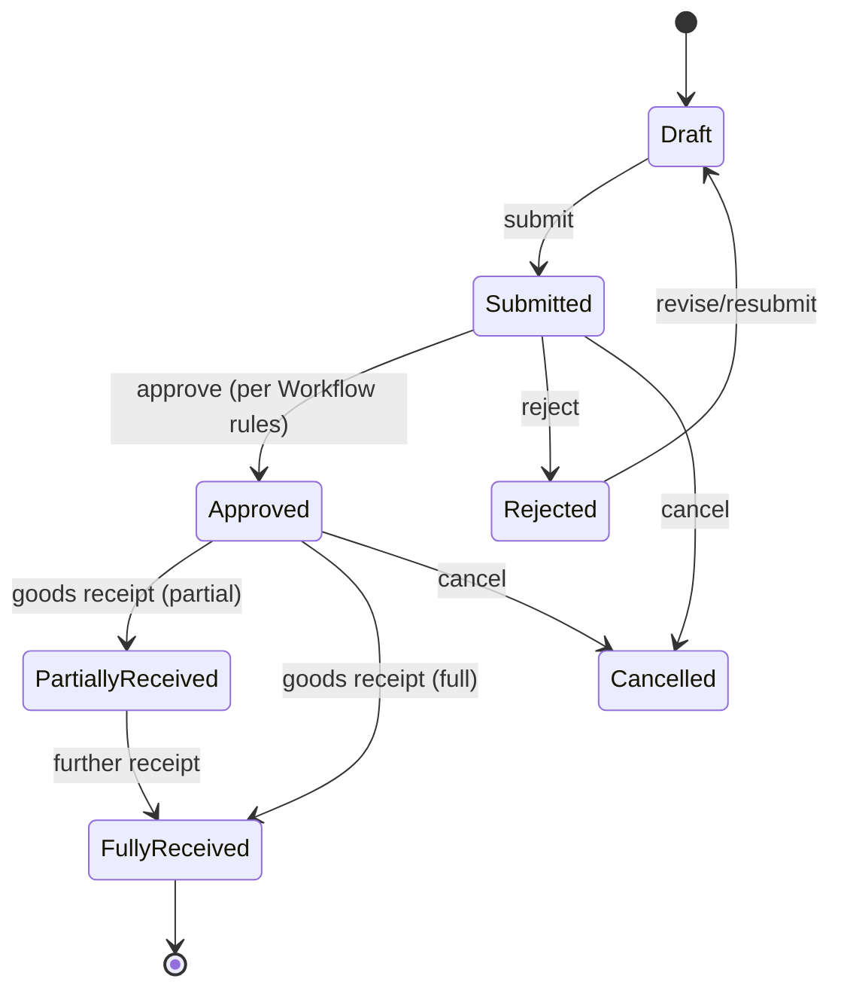
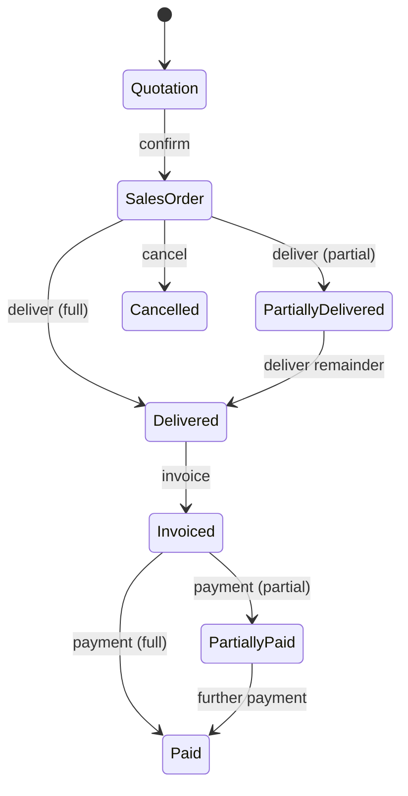

# Business Rules & Workflows

Every important process follows the same discipline (spec #66):

```
Input → Validation → Business Rules → DB Transaction
      → Inventory Impact → Accounting Impact → Audit → Output
```

State transitions are validated server-side; invalid transitions raise
`INVALID_STATE_TRANSITION` (spec #20, #21).

## Purchase workflow (spec #20)


- A **cancelled** PO cannot receive goods.
- Flow: Purchase Request → Purchase Order → Goods Receipt → Supplier Invoice →
  Payment. Receipt drives inventory + GRNI accounting; invoice clears GRNI to AP.

## Sales workflow (spec #21)


Supports partial delivery, partial payment, discounts, taxes, returns,
cancellation, and outstanding-balance tracking. Delivery issues stock (COGS);
invoice posts revenue + AR.

## Returns (spec #22)

Never delete the original to simulate a return. A return is its own document that
creates inventory movements, accounting entries, and balance effects (see the
matrices in [INVENTORY.md](INVENTORY.md) and [ACCOUNTING.md](ACCOUNTING.md)).
Return quantity cannot exceed the net delivered/received quantity →
`INVALID_RETURN_QUANTITY`.

## Payments (spec #23)

Cash / bank; customer receipts and supplier payments; partial and advance
payments; allocation across documents. Each payment posts a journal and links to
the settled documents. Duplicate processing prevented via idempotency key +
`UNIQUE` constraint → `DUPLICATE_PAYMENT`.

## Approval engine (spec #25 — configurable, not hard-coded)

Rules are data: threshold amount, department, branch, role, sequence. Example:

```
Purchase < 100,000  → Manager
Purchase ≥ 100,000  → Manager, then Director   (sequential)
```
Supports sequential steps, rejection with comments, resubmission, and role/branch/
department targeting. Every approval and rejection is audited. Thresholds live in
settings — no `if amount > 100000` in code.

## Document numbering

Per-company sequences, concurrency-safe (see [DATABASE.md](DATABASE.md#safe-document-numbering)).

## Configurable parameters (spec #54)

currency & symbol, tax/VAT rates, fiscal year, numbering formats, stock policy,
negative-inventory policy, approval thresholds, default warehouse, default
accounts, rounding strategy, decimal precision. All per-company; none hard-coded.

## Documented assumptions (spec #68)

Where the spec is ambiguous, a safe, configurable default is chosen, documented,
and tested rather than silently invented:
1. Inventory valuation = moving weighted average (default); FIFO pluggable later.
2. Goods-receipt accrual via GRNI clearing account.
3. Sales returns valued at current moving average unless specific-cost enabled.
4. Negative stock disabled by default (configurable per company).
5. Advance payments held on an unallocated-credit account until applied.

## Bangladesh-ready (spec #40)

BDT / ৳, configurable VAT, local addresses, Bangla text support, BD phone
formats, configurable fiscal year. None of these are hard-coded so tightly that
international use is blocked — they are configuration.
