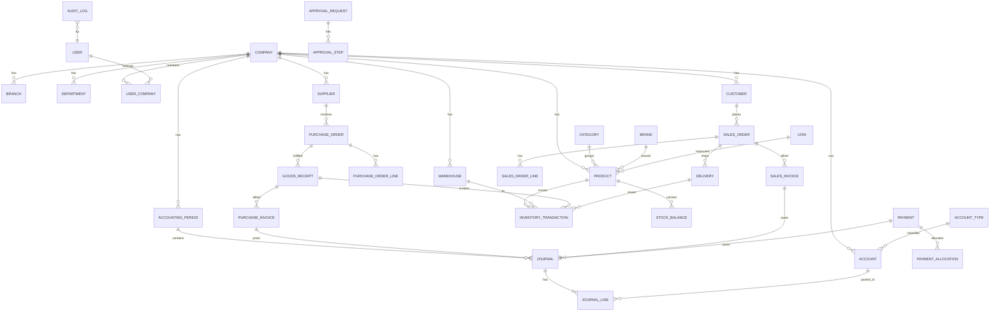

# Database Design

PostgreSQL 16. Integrity is enforced at **both** the application/domain layer and
the database layer wherever practical (spec #28). Money and quantities use
`NUMERIC`, never floating-point (spec #27, #52).

## Conventions

- Every company-scoped table has `company_id` (FK, indexed) — enforced by a
  global Eloquent scope, never trusted from the client (spec #6).
- Surrogate PK `id bigint` (identity). Foreign keys always constrained.
- `created_at`, `updated_at`; soft deletes only where logically safe (never on
  ledgers, journals, invoices, payments — those use cancellation/reversal, spec #29).
- Monetary columns: `NUMERIC(19,2)` (precision configurable). Quantity:
  `NUMERIC(19,4)`. Unit cost: `NUMERIC(19,6)`.
- Document numbers are unique per company + sequence, generated safely (below).
- Enums represented as constrained `varchar` + `CHECK`, mirrored by PHP enums.

## Core entity map (ERD)



## Integrity constraints (representative — spec #28)

```
amount    >= 0                       -- where prohibited to be negative
quantity  >= 0                       -- stock_balance, unless negative policy on
UNIQUE (company_id, document_number) -- invoices, POs, GRNs, payments
Σ debit == Σ credit                  -- per journal (trigger, on commit)
debit >= 0 AND credit >= 0 AND NOT (debit > 0 AND credit > 0)  -- journal_line
FK valid on every relationship; ON DELETE RESTRICT for ledger references
CHECK status IN (...)                -- state machines
```

## Safe document numbering (spec #24)

Never `MAX(number)+1` (races under concurrency). Instead a per-company,
per-series counter row locked with `SELECT ... FOR UPDATE` inside the same
transaction that creates the document, plus a `UNIQUE (company_id, series, number)`
constraint as the final backstop. Formats configurable, e.g. `INV-2026-000001`,
`PO-2026-000001`, `GRN-2026-000001`, `PAY-2026-000001`. Proven with a concurrent-
generation test.

## Immutability at the DB layer

`BEFORE UPDATE OR DELETE` triggers on `journal`, `journal_line`, and
`inventory_transaction` reject mutation of posted/committed rows. The app's
restricted role cannot disable these triggers (see [ACCOUNTING.md](ACCOUNTING.md)).

## Grants

Migrations run as the owner role; after creating tables they `GRANT SELECT,
INSERT, UPDATE, DELETE` to the app role (`erp_app`) — but never `TRIGGER`/`ALTER`
privileges, preserving the immutability guarantees.

## Indexing & performance (spec #57)

Target scale ~100k products / ~1M transactions. Indexes on all FKs,
`(company_id, ...)` composite indexes for scoped queries,
`(product_id, warehouse_id)` on the inventory ledger, `(account_id, journal_id)`
on journal lines, and date columns used by reports. Reports use projections and
server-side pagination; no unbounded result sets to the browser (spec #34).

## Migrations (spec #58)

Laravel migrations only; every migration has a working `down()`. Seeders provide
realistic demo data (spec #59) with credentials sourced from env, never a
hard-coded production password.
